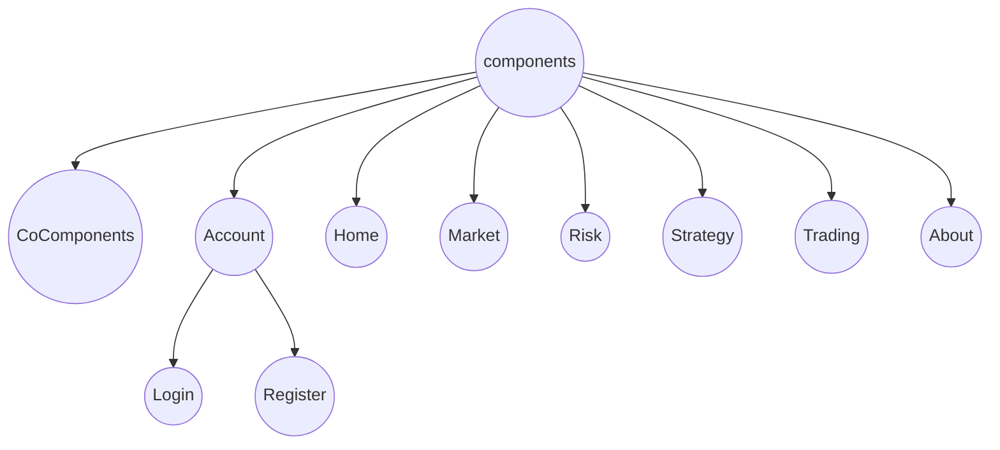

---
编辑于2023.1.3 记录一下我这几天的心得，也作为大家初步的指南吧
---

[TOC]


# 2022-CitiCup

> 首先把项目名称修改为 CitiCup


## 1. 项目的结构

### 1.1. vite.config.js（不需要修改）

这个文件对整个项目进行一些总的配置。

你可以在其中看到这句话：

```vue
alias:{
  "~": path.resolve(__dirname, "src")
}
```

它的意思是将 "～" 作为 "CitiCup/pages" 这个目录的一个别名

### 1.2. windi.config.js（不需要修改）

这个文件对windicss进行一些配置


### 1.3. package.json 和 package-lock.json（不懂，反正都不用改）

### 1.4. index.html （不需要修改）

项目入口

### 1.5. /public文件夹（不需要修改）

### 1.6. /src 文件夹（需要修改）

##### 1.6.1. /components

— — — — — — — — — — — —          截至2023.1.3                 — — — — — — — — — — — —

components文件夹包括下面这些子文件(夹)，


- 其中CoComponents表示剩下七个页面共同使用的组件，其它每个文件夹表示一个页面。

- 除了CoComponents文件夹外，每个文件夹下：
  - 包括一个和文件夹**同名**的组件，表示这个页面的主要组件；
  - 还（可能）包括images子文件夹和subComponents子文件夹，它们的作用如名。

目前我们的项目包括七个主要界面，下面我们给出组件和页面的对应关系：


- 首页：Home.vue
- 关于我们：About.vue
- 账户：Account.vue
- 做市服务/行情揭示：Market.vue
- 做市服务/交易管理：Trading.vue
- 做市服务/策略管理：Strategy.vue
- 做市服务/风险控制：Risk.vue


其中，Home页面我在前几天的时间里尝试完成了(已经完工)，Account页面由耿瑞林开始写了(尚未完工)

所以我们现在~~还剩6个页面~~ 还剩5.5个页面

令人抱歉的是，Home页面被我写出了不少牵一发而动全身的bug，所以大家不要直接修改/Home文件夹下的组件，如果有必要修改的话，请联系我来修改

在/CoComponents文件夹下，截至2023.1.3，我们给出了五个可以直接使用的组件：


每个组件可以提供相关的参数，来让组件更加灵活（具体的参数可以查看\<script>部分的props），以MiniTitle为例，你可以提供以下的参数：


如果不提供的话，也不会报错，但是相应的位置会空出来


##### 1.6.2. /router

这里是vue-route部分需要的文件夹，具体的需要大家去了解什么是vue-router


##### 1.6.3. /store

这里是vuex4(vue3 对应着 vuex4)需要的文件夹，具体的需要大家去了解vuex


##### 1.6.4. /style（基本上没用）

这里可以放一些css文件，但是大概率是没用的


##### 1.6.5. App.vue

> 不太需要进行改动，除非进行了新的配置

总的组件（相当于main）


##### 1.6.6. main.js

> 不太需要进行改动，除非进行了新的配置

程序的入口

#### 

## 2. 项目的运行

我们使用的是vue3 + vite。在 CitiCup目录下进入终端，输入

```shell
npm install
npm run dev
```

如果出现报错的话，可以尝试先删除项目根目录下的 /node_modules 文件夹，然后再输入

```shell
npm install
npm run dev
```


## 3. 项目的时间安排

今晚开会待定


## 4. 一些规范

> 这一部分不太重要，但是俺有强迫症，还是希望大家能格式统一


- 所有的主页面已经规定了，就只有这七个，非必要请不要再添加了。大家如果要新开页面的话，修改路由请附属在某一个主页面后面，比方说Register作为Account的子组件，它的路由就应该是/account/register：

  

  

  

- 组件的命名最好能用一个单词，并且首字母大写

- 组件的name属性最好和组件的名称相同，例如，Accout.vue的name就是Account：

  

  

  

- 图片要尽可能地压缩大小，最好能到kb级别（在Home.vue和它的子组件中使用到的图片的大小已经超过了80M，这是十分惊人的。删除掉不必要的图片后，仍然有大几十Mb的大小，我会在后期处理Home页面图片的大小，大家也要尽可能用P图软件压缩一下自己的页面的图片）

- etc: 其他的注意事项大家也可以添加


## 5. 一些工具

> 这里只提供一个名词，大家自行了解一下详情
>
> 其实这里我也没怎么用，这些都是比较高级的用法，用来减少大家工作量的。大家可以根据自己的情况来了解


### 5.1. 样式

- animate.css
- style.css

- windicss

- elementUI


### 5.2. 逻辑

- vue-router：路由

- vuex：组件之间共享方法和数据（[猴子都能看懂的VueX教程](https://juejin.cn/post/6928468842377117709)）


