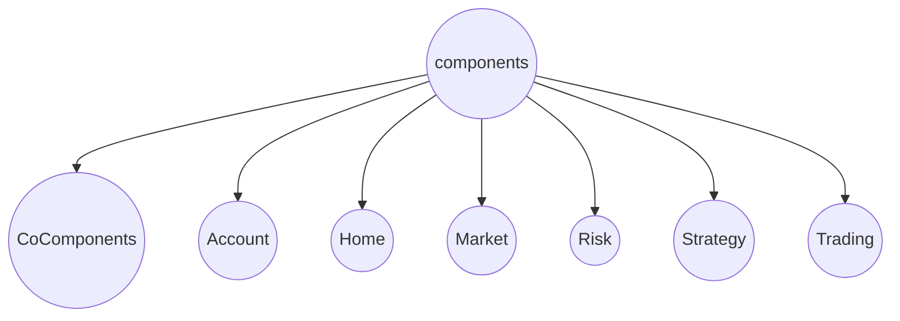

# 2022-CitiCup

### 1. 项目的结构

#### 1.1. vite.config.js

​		这个文件进行一些总的配置。你可以在其中看到这句话

```vue
alias:{
  "~": path.resolve(__dirname, "src")
}
```

它的意思是将 "～" 作为 "CitiCup/pages" 这个目录的一个别名


#### 1.2. components


其中CoComponents表示剩下六个页面共同使用的组件，其它每个文件夹表示一个页面。
除了CoComponents文件夹外，每个文件夹下包括一个和文件夹同名的组件，表示这个页面的主要组件；
还（可能）包括images子文件夹和subComponents子文件夹，它们的作用如名。

#### 1.3. router

这是路由界面，用来定义页面的跳转。大家可以不用修改这个文件

### 2. 项目的运行

我们使用的是vue3 + vite。在 CitiCup目录下进入终端，输入

```shell
npm install && npm run dev
```


### 3. 项目的时间安排


动画效果: animate.css

style.css

windicss

elementUI

路由: vue-router

组件之间共享方法和数据: 
[vuex](https://blog.csdn.net/qq_45934504/article/details/123462736), 
[猴子都能看懂的VueX教程](https://juejin.cn/post/6928468842377117709)