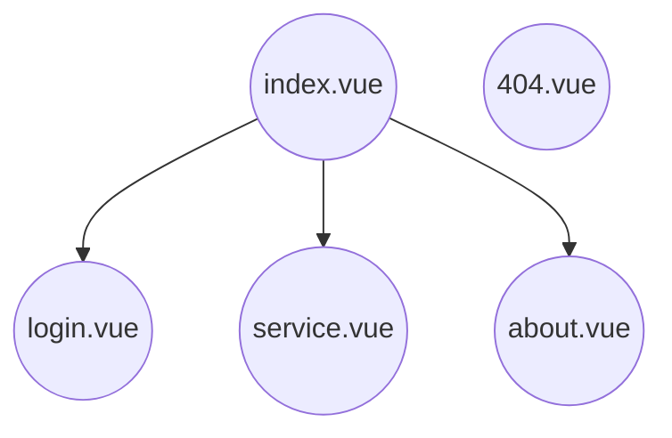

# 2022-CitiCup

### 1. 项目的结构

#### 1.1. vite.config.js

​		这个文件进行一些总的配置。你可以在其中看到这句话

```vue
alias:{
  "~": path.resolve(__dirname, "src")
}
```

它的意思是将 "～" 作为 "CitiCup/pages" 这个目录的一个别名


#### 1.2. pages

pages文件夹下所有的vue文件都代表一个页面，其中 index.vue 应当表示一个主页面，在其中点击可跳转至其他界面



#### 1.3. router

这是路由界面，用来定义页面的跳转。大家可以不用修改这个文件

### 2. 项目的运行

我们使用的是vue3 + vite。在 CitiCup目录下进入终端，输入

```shell
npm install && npm run dev
```


### 3. 项目的时间安排

